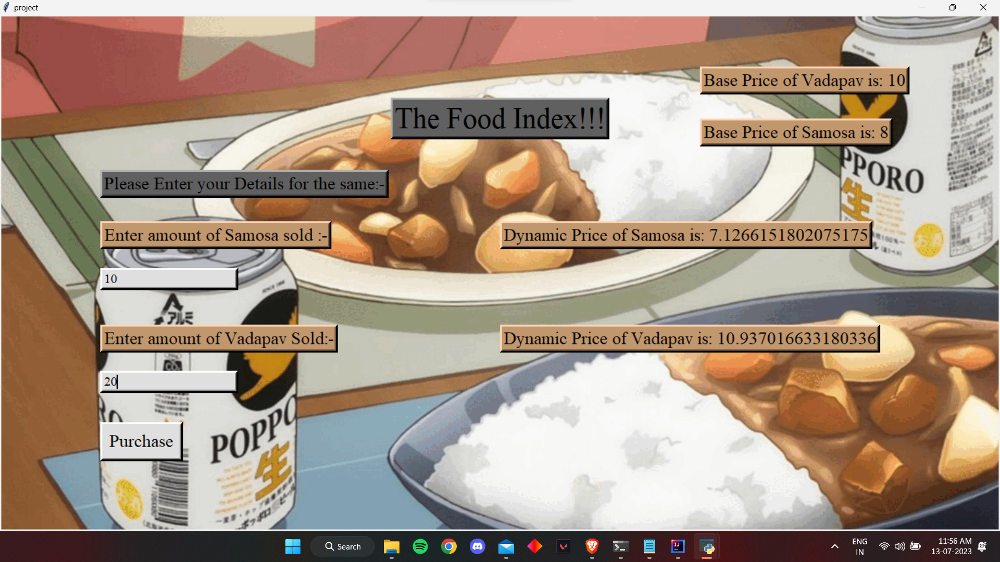

# Food Pricing Model



This project is a food pricing model that uses machine learning techniques to predict the dynamic prices of Vadapav and Samosa based on the quantity sold and the time of day. The model uses Linear Regression and Random Forest Regression algorithms to make the predictions.

## 🚀 Getting Started

To run the project, you need to have Python and the required libraries installed. Follow the steps below to set up the project:

1. Clone the repository to your local machine.
2. Install the necessary dependencies by running the following command:

   ```shell
   pip install pandas scikit-learn tkinter
   ```

3. Run the `TFI.py` file to start the application.

## ✨ Features

- The application provides a graphical user interface (GUI) built using the Tkinter library.
- It allows the user to enter the quantity of Samosa and Vadapav sold.
- The model then predicts the dynamic prices of both items based on the input.
- The predicted prices are displayed on the screen.
- The base prices of Samosa and Vadapav are also shown.

## 💻 Usage

1. Launch the application by running the `TFI.py` file.
2. The main screen will appear with a welcome message and a start button.
3. Click the "Start!" button to proceed.
4. A new window will open, prompting you to enter the quantities sold for Samosa and Vadapav.
5. Enter the quantities in the respective input fields.
6. Click the "Purchase" button to calculate the dynamic prices.
7. The dynamic prices of Samosa and Vadapav will be displayed on the screen.
8. The base prices will also be shown.
9. You can repeat the process by entering new quantities and clicking the "Purchase" button again.

## 📷 Screenshots

Include relevant screenshots of the application to provide a visual representation of the interface and functionality.

## 🤝 Contributing

Contributions to this project are welcome. If you find any issues or have suggestions for improvements, feel free to open an issue or submit a pull request.

## 📝 License

This project is licensed under the [MIT License](LICENSE).

## 🙏 Acknowledgements

- The project uses the following libraries: Pandas, scikit-learn, and Tkinter.
- The machine learning models are based on the Linear Regression and Random Forest Regression algorithms.
- The dataset used for training the models is stored in the `Sale_data.csv` file.

## 📞 Contact

For any questions or inquiries, please contact Om Hinge at iam.acekiller.om@gmail.com
